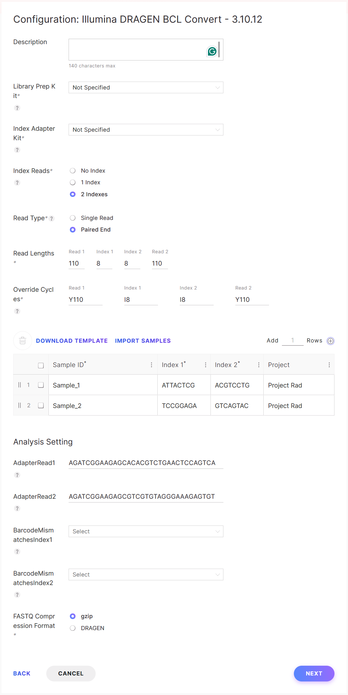
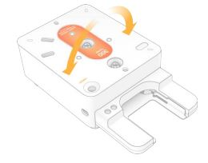
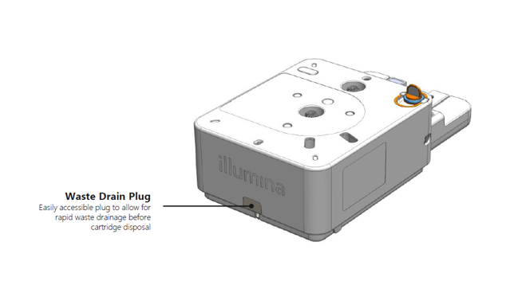

# Frag-MaP with Enrichment (azide beads)

Seth D. Veenbaas  
07/15/2024

### Goal:

Enrich rRNA photo-crosslinked to fully-functionalized fragments in B. subtilis total RNA.

## Protocol Overview:

* [Fragment total RNA](#partial-fragmentation-of-total-rna)
* [Click chemistry](#click-chemistry-with-alkyne-rna--azide-oligo-primer-using-50-dmso-denaturant)
* [RNA-alkyne enrichment](#rna-alkyne-enrichment)
* [MaP-RT](#mutational-profiling-rt-dms-optimized)
* [Second strand synthesis](#second-strand-synthesis)
* [NEB Ultra II library prep](#dna-library-prep-adapter-ligation---nebnext-ultra-ii)
* [Pool and dilute](#pool-and-dilute-library)

## Sample Details:

RNA provided from Frag-MaP Cell Probing 4 experiment (200 μM).

| Sample ID | Replicate |     Ligand      | [RNA] (ng/μL) | i7 index | i5 index |
| :-------- | :-------: | :-------------: | :-----------: | :------: | :------: |
|           |           |                 |               |          |          |
|           |           |                 |               |          |          |
|           |           |                 |               |          |          |
|           |           |                 |               |          |          |
|           |           |                 |               |          |          |
|           |           |                 |               |          |          |
|           |           |                 |               |          |          |
|           |           |                 |               |          |          |
|           |           |                 |               |          |          |
|           |           |                 |               |          |          |
|           |           |                 |               |          |          |
|           |           |                 |               |          |          |
|           |           |                 |               |          |          |
|           |           |                 |               |          |          |
|           |           |                 |               |          |          |
|           |           |                 |               |          |          |          

## Partial Fragmentation of total RNA

Fragment RNA to around 200 nt average length.

### Materials:

- Total RNA (13.5 μg)
- [NEBNext® Magnesium RNA Fragmentation Module](https://www.neb.com/products/e6150-nebnext-magnesium-rna-fragmentation-module#Product%20Information)

### Protocol:

1. Mix the following components in a sterile PCR tube:

| Component                      |    Volume |
| :----------------------------- | --------: |
| Purified total RNA (~13.5 μg)  |     27 μL |
| RNA Fragmentation Buffer (10X) |      3 μL |
| **Total**                      | **30 μL** |      

2. Incubate in a preheated thermal cycler for 2 minutes at 94°C.
3. Transfer tube to ice immediately.
4. Add 3 μl 10X RNA Fragmentation Stop Solution.

5. Cleanup with Monarch RNA cleanup kit.

### More Information:

[NEBNext® Magnesium RNA Fragmentation Module Protocol](https://www.neb.com/protocols/0001/01/01/nebnext-magnesium-rna-fragmentation-module-protocol-e6150)

## Monarch RNA Cleanup kit

### Protocol:

* Follow manufacture [protocol](https://www.neb.com/en-us/-/media/nebus/files/manuals/manualt2030_t2040_t2050.pdf?rev=5f0009332e2242f5bdd07c3718239cd7&hash=A73AC552E96334268FC0B3B6E10154F6).
* Elute in 12.5 μL

### Notes:

* The protocol for seperation of Large and Small RNA into Fractions did not produce better results than the standard protocol.

## Click chemistry with alkyne-RNA & azide-oligo primer using 50% DMSO denaturant

This protocol is intented to add steric bulk to increase MaP-RT mutation efficency at fully functionalized fragment crosslink sites.

### Materials:

Multiple reagents amounts by the number of intended samples

| Reagents              | [Reagent]  | [Final] | Amount      |
| :-------------------- | :--------- | :------ | :---------- |
| Total RNA-alkyne – 4X | ~13.5 μg   | ~0.4 μM | 12 μL       |
| N3-PEG-magbead – 5X   | 50 μmol/mL | 0.5 μM  | 10 μL       |
| DMSO                  | -          | -       | 25 μL       |
| Ascorbic Acid – 20X   | 10 mM      | 500 μM  | 2.5 μL      |
| Cu(II): TBTA – 41.7X  | 10 mM      | 240 μM  | 1.2 μL      |
| **TOTAL**             | -          | -       | **50.7 μL** |

* [N3-PEG-magbead 50 μmol/mL](https://www.bangslabs.com/product-selection/CBMFY01b) were purchased from Bangs Laboratories, Inc.

### Protocol:

1. Prepare fresh 10 mM Ascorbic acid stock 20X:

   - Combine reagents.
   - Sparge solution with N2 and use immediately.

   | Reagents      | Amount     |
   | :------------ | :--------- |
   | Ascorbic acid | 9.0 mg     |
   | NF Water      | 5.0 mL     |
   | **TOTAL**     | **5.0 mL** |

2. Dilute RNA:

   - Add RNA-alkyne and water to a strip of PCR tubes.

   | Reagents          | [Reagent]  | Final [RNA] | Amount    |
   | :---------------- | :--------- | :---------- | :-------- |
   | RNA-alkyne – 10X  | 1000 ng/μL | ~ 0.4 μM    | 12 μL     |
   | Nuclease free H2O | -          | -           | - μL      |
   | **Subtotal**      | -          | -           | **12 μL** |

3. Heat denature RNA:

   - Incubate RNA at 95 °C for 2 min.
   - Snap cool on ice for 2 min.

4. Add N3-PEG-Magbead to tubes:

   | Reagents            | [Reagent]  | [Final] | Amount    |
   | :------------------ | :--------- | :------ | :-------- |
   | N3-PEG-Magbead – 5X | 50 μmol/mL | 0.5 μM  | 10 μL     |
   | **Subtotal**        | -          | -       | **22 μL** |

   **NOTE: Batch samples can be kept on ice after HEPES addition.**

5. Denature RNA by adding DMSO:

   - Add DMSO to each sample.
   - Briefly vortex.

     | Reagents     | [Reagent] | [Final] | Amount    |
     | :----------- | :-------- | :------ | :-------- |
     | DMSO         | -         | -       | 25 μL     |
     | **Subtotal** | -         | -       | **47 μL** |

6. Start click reaction:

   - Add ascorbic acid and Cu(II)/TBTA mix to samples.

     | Reagents             | [Reagent] | [Final] | Amount      |
     | :------------------- | :-------- | :------ | :---------- |
     | Ascorbic Acid – 20X  | 10 mM     | 0.5 mM  | 2.5 μL      |
     | Cu(II): TBTA – 41.7X | 10 mM     | 240 uM  | 1.2 μL      |
     | **Total**            | -         | -       | **50.7 μL** |

     **NOTE: Initiate reaction within 5 minutes of adding DMSO (RNA stays denatured for ~30 minutes).**

7. Incubate reaction.

   - Cover reaction.
   - Incubate at 40 °C for ~20 minutes.

     **NOTE: No further conversion after 1 h and more RNA degradation occurs.**

8. Quench reaction.

   - Add 1.0 μL of 0.5 M EDTA to each sample (50 μL).

## RNA-Alkyne enrichment

Enrich crosslinked RNA via azide-magbead pull-down.

### Before starting:

- click Azide-PEG-magbeads to Alkyne-RNA.

### Materials:

- 0.5M Tris pH 7.5
- 2M NaCl
- 10% Tween-20
- 0.5M EDTA

### Protocol:

1. Prepare Binding/Wash Buffer:

    | Component   | [reagant] | [Final] | Amount (μL) |
    | :---------- | :-------: | :-----: | ----------: |
    | NaCl        |    2 M    |   1 M   |      12,500 |
    | Tris pH 7.5 |    1 M    |  10mM   |         250 |
    | EDTA        |   0.5 M   |  1 mM   |          50 |
    | TWEEN-20    |    10%    |  0.01%  |          25 |
    | NFW         |     -     |    -    |      12,175 |
    | **TOTAL**   |   **-**   |  **-**  |  **25,000** |

2. Pull-down beads:

   * Immobilize beads with magnetic rack.
   * Remove and discard supernatant.

3. Wash beads 3 times:

   * Resuspend beads in 200 μL of Wash Buffer (1X).
   * Immobilize beads with magnetic rack.
   * Remove and discard supernatant.
   * Repeat (x3)

4. Resuspend beads:

    * Resuspend beads in 7.5 μL of NFW

 
# Mutational profiling RT (DMS-optimized)

This is protocol is based on Smola et.al., 2015. It has been optimized for the
synthesis of long cDNA from DMS modified RNA.

## Before starting:

[Modify RNA](../chemical-reactions/)
[Purify RNA](../purification/)

## Materials:

* 0.5 M Tris pH 8.0
* 0.75 M KCl
* 0.1 M DTT
* RNA (1 ng to 5 μg of total RNA)
* 2 µM RT primer (50 to 250 ng random primer)
* 10 mM dNTP mix
* 5 M betaine
* 40 mM MnCl2
* SuperScript II

## Protocol:

1. Create fresh 10X NTP minus:

    | Reagent         | Amount    |
    | :-------------- | :-------- |
    | 1 M Tris ph 8.0 | 20 uL     |
    | 2 M KCl         | 15 uL     |
    | 1 M DTT         | 4 uL      |
    | NF Water        | 1 uL      |
    | **TOTAL**       | **40 uL** |

2. For each RNA sample combine:

    | Reagent           | Amount    |
    | :---------------- | :-------- |
    | RNA (~10 ng)      | 7.5 uL    |
    | nonamer (~100 ng) | 0.5 uL    |
    | 10 mM dNTPs       | 2 uL      |
    | **TOTAL**         | **10 µL** |

3. Denature and anneal ribosome by incubating at 90°C for 5 min, then cool on ice.
4. Create the following master mix:

    ***(multiply by number of samples+1)***

    | Reagent       | Amount   |
    | :------------ | :------- |
    | 10X NTP minus | 2 uL     |
    | 5 M Betaine   | 4 uL     |
    | 40 mM MnCl2   | 3 uL     |
    | **TOTAL**     | **9 uL** |

5. Add 9 µL of master mix to each sample.
6. Incubate at 25°C for 2 min.
7. Add 1 µL of SuperScript II.
8. Set Thermocycler to this program:
   * Incubate at 25°C for 10 min.
   * Incubate at 42°C for 90 min.
   * 10 cycles of 50°C for 2 min and 42°C for 2 min.
   * Deactivate at 70°C for 10 min.
   * Hold at 4°C.

## Notes

* Thermocycler had an error. Held at 25 °C for 3 hours before starting protocol.

## More Information:

* [First-Stand cDNA Synthesis Using SuperScript II RT](https://tools.thermofisher.com/content/sfs/manuals/superscriptII_pps.pdf)

# Second Strand Synthesis

From first strand synthesis product, a mix of enzymes polymerizes a second
cDNA from the first cDNA of a DNA-RNA hybrid, then digests away the RNA.

## Before starting:

* [first strand synthesis](map-rt-dms.md)
* [cDNA purification](../purification/spri-bead-purification.md)

## Materials:

* NEBNext second strand synthesis enzyme mix
* NEBNext second strand synthesis 10x buffer
* Fresh 80% EtOH

## Protocol:

**Always keep 2nd Strand Enzyme cold (below 16°C)**

1. Pull-down cDNA product on beads:
   * Immobilize beads with magnetic rack.
   * Remove and discard supernatant.

2. Prepare reaction:
    * Resuspend cDNA on-ice
    * Pipette mix

    | Reagent                        | Amount    |
    | :----------------------------- | :-------- |
    | sscDNA                         | (on-bead) |
    | nucleotide-free water          | 32 μL     |
    | 10X 2nd Strand Reaction Buffer | 4 μL      |
    | 2nd Strand Enzyme Mix          | 2 μL      |
    | **TOTAL**                      | **40 μL** |

3. Incubate at 16°C for 60 min.

## Next Steps:

* [Purify DNA](#cdna-purification---ampure-beads)
* [HS DNA Qubit assay](#qubit)
* [NEBNext Ultra II library prep](#dna-library-prep-adapter-ligation---nebnext-ultra-ii)

### cDNA purification - AMpure beads

### Material:

* AMpure beads (equalibriate to RT)
* Fresh 80% ethanol
* Magnetic holder

### Bead Ratio:

1.8X

### Protocol:

1. Beads added to reaction mixture (1.8X)
2. Incubate at room temp. for 5 min.
3. Place in magnetic holder for 5 min.
4. Remove most of the susernatant
5. Wash beads with 80% ethanol (30 seconds) twice.
6. Add 20 μL of water, resuspend pellet, and incubate for 5 minutes.
7. Remove and keep supernatant.

### More Information:

* [NGS Beads for DNA Size Selection](https://gc3fstorage.uoregon.edu/IMAGES/Evaluation_of_Omega_Mag-Bind_TotalPure_NGS_Beads_MWeitzman_April2018.pdf)

## Qubit

Quantify the dscDNA product from second strand synthesis via Qubit HS DNA assay. 

### Material

* Qubit tubes
* Working solution
* Standards 1 & 2

### Protocol

1. Create standards:
    * Add 190 μL of working solution into Qubit tube
    * Add 10 μL of standard
    * Equalibrate to RT
2. Create samples:
    * Add 198 μL of working solution into Qubit tube
    * Add 2 μL of cDNA
    * Equalibrate to RT
3. Incubate for 2 minutes before reading concentrations

### Results:

| Sample ID | [dscDNA] ng/μL |
| :-------- | :------------: |
|           |                |
|           |                |
|           |                |
|           |                |
|           |                |
|           |                |
|           |                |
|           |                |
|           |                |
|           |                |
|           |                |
|           |                |
|           |                |
|           |                |
|           |                |
|           |                |

# DNA Library Prep (Adapter Ligation) - NEBNEXT Ultra II

## Materials:

* dsDNA (500 pg - 1 μg)
* (green) NEBNext Ultra II End Prep Enzyme Mix
* (green) NEBNext Ultra II End Prep Reaction Buffer
* (red) NEBNext Ultra II Ligation Master Mix
* (red) NEBNext Ligation Enhancer
* (blue) NEBNext Ultra II Q5 Master Mix
* NEBNext Oligo Kit
* 80% Ethanol

## Protocol:

1. Prepare Ends.

    * Add the following components into a PCR tube:

        | Components               |    Volume |
        | :----------------------- | --------: |
        | dsDNA                    |     25 μL |
        | End Prep Reaction Buffer |    3.5 μL |
        | End Prep Enzyme Mix      |    1.5 μL |
        | **TOTAL**                | **30 μL** |

    * Mix thoroughly and spin down.
    * Inbucate in thermal cycler with lid set to > 75 °C:

        | Step      | Time (min.) | Temperature (°C) |
        | :-------- | :---------: | :--------------: |
        | Prep ends |     30      |        20        |
        | Denature  |     30      |        65        |
        | End       |    HOLD     |        4         |

2. Adapter Ligation. (Adds ~60 nt)

    * Dilute adaptors based on input DNA quantity (from NEBNext Oligo Kit):

        | Input DNA      |    Adpator Dilution    | Working [Adapter] |
        | :------------- | :--------------------: | :---------------: |
        | 101-1000 ng    |      No Dilution       |       15 μM       |
        | 5 - 100 ng     |          1:10          |      1.5 μM       |
        | **0.5 - 5 ng** | **1:25 (recommended)** |    **0.6 μM**     |
    
    * Add the following components directly into the End Prep Reaction Mixture:

        * **NOTE: Do NOT premix Adapter with Master Mix or Ligation Enhancer.**

        | COMPONENT                                  |       VOLUME |
        | :----------------------------------------- | -----------: |
        | End Prep Reaction Mixture                  |        30 µl |
        | (red) NEBNext Adaptor (diluted)            |      1.25 µl |
        | (red) NEBNext Ultra II Ligation Master Mix |        15 µl |
        | (red) NEBNext Ligation Enhancer            |       0.5 µl |
        | **TOTAL**                                  | **47.75 µL** |

    * Mix thoroughly and spin down.
    * Incubate at 20 °C for 15 minutes with lid heater off.
    * Add USER enzyme.

        | COMPONENT                 |       VOLUME |
        | :------------------------ | -----------: |
        | Ligation reaction mixture |     47.75 µL |
        | (red) USER enzyme         |      1.50 µl |
        | **TOTAL**                 | **49.25 µL** |

    * Mix throughly.
    * Incubate at 37 °C for 15 minutes with the lid heater set to > 47 °C

3. Cleanup of Adaptor-ligated DNA - SPRI beads

    **Bead Ratio: 1.4x (or lower)**

    1. Beads added to reaction mixture (1.4X)
    2. Incubate at room temp. for 5 min.
    3. Place in magnetic holder for 5 min.
    4. Remove most of the supernatant
    5. Wash beads with 80% ethanol (30 seconds) twice.
    6. Add 17 μL of water, resuspend pellet, and incubate for 5 minutes.
    7. Remove and keep supernatant.

4. PCR Amplification (Adds ~60 nt)

    * Add the following components to a PCR strip:

    | COMPONENT                             |    VOLUME |
    | :------------------------------------ | --------: |
    | Adaptor Ligated DNA Fragments         |     15 µl |
    | (blue) NEBNext Ultra II Q5 Master Mix |     25 µl |
    | Index Primer/i7 Primer                |      5 µl |
    | Universal PCR Primer/i5 Primer        |      5 µl |
    | **TOTAL**                             | **50 µl** |

    * Mix thoroughly and spin down.
    * Choose number of PCR cycles using the table below:

    | INPUT DNA | # OF CYCLES (YIELD ~100 ng) |
    | --------: | :-------------------------: |
    |    100 ng |              3              |
    |     50 ng |             3–4             |
    |     10 ng |             6–7             |
    |      5 ng |             7–8             |
    |      1 ng |            9–10             |
    |    0.5 ng |           10–11+            |
 
    * Perform PCR amplification using the following PCR cycling conditions:

    | STEP                 | PCR Cycle Step      | TEMP  | TIME       | CYCLES                    |
    | :------------------- | ------------------- | ----- | ---------- | ------------------------- |
    | Initial Denaturation |                     | 98 °C | 30 seconds | 1                         |
    | PCR cycles:          |                     |       |            |                           |
    |                      | Denaturation        | 98 °C | 10 seconds | 3-15 **(15 recommended)** |
    |                      | Annealing/Extension | 65 °C | 75 seconds | 3-15 **(15 recommended)** |
    | Final Extension      |                     | 65 °C | 5 minutes  | 1                         |
    | HOLD                 |                     | 4 °C  | Hold       | 1                         |

5. Cleanup of PCR Reaction - SPRI beads

    **Bead Ratio: 0.95x**

    1. Beads added to reaction mixture (0.95X)
    2. Incubate at room temp. for 5 min.
    3. Place in magnetic holder for 5 min.
    4. Remove most of the supernatant
    5. Wash beads with 80% ethanol (30 seconds) twice.
    6. Add 20 μL of water, resuspend pellet, and incubate for 5 minutes.
    7. Remove and keep supernatant.

6. Repeat step 5 

    **Bead Ratio: 0.95x**

## Notes:

* Length of DNA = Insert (~150) + adaptor (60 nt) + primers (60 nt) = 270
* Frag-MaP usually required 15 PCR cycles

## Next Steps:

* Qubit
* Bioanalyzer

# Qubit

Quantify the dscDNA product from second strand synthesis via Qubit HS DNA assay. 

## Material

* Qubit tubes
* Working solution
* Standards 1 & 2

## Protocol

1. Create standards:
    * Add 190 μL of working solution into Qubit tube
    * Add 10 μL of standard
    * Equalibrate to RT
2. Create samples:
    * Add 196 μL of working solution into Qubit tube
    * Add 4 μL of cDNA
    * Equalibrate to RT
3. Incubate for 2 minutes before reading concentrations

## Results

| Sample ID | [dscDNA] ng/μL |
| :-------- | :------------: |
|           |                |
|           |                |
|           |                |
|           |                |
|           |                |
|           |                |
|           |                |
|           |                |
|           |                |
|           |                |
|           |                |
|           |                |
|           |                |
|           |                |
|           |                |
|           |                |

# Agilent Tape Station

Determine the average length of sequencing library.

## Materials

* High sensitivity D1000 DNA sample buffer
* High sensitivity D1000 DNA ladder
* High sensitivity D1000 DNA screentape
* Tape station tubes and caps

## Specification

| Analytical specifications | High Sensitivity D1000 ScreenTape assay |
| ------------------------- | :-------------------------------------: |
| Sizing range              |                35–1000bp                |
| Sizing accuracy           |                  ±10 %                  |
| Quantitative range        |              10–1000 pg/µL              |

## Protocol 

1. Allow D1000 Reagents to equilibrate to room temperature.

2. Prepare ladder (position: A1)

    | COMPONENT           |   VOLUME |
    | :------------------ | -------: |
    | D1000 Sample buffer |     2 µl |
    | Ladder              |     2 µl |
    | **TOTAL**           | **4 µl** |

3. Prepare samples (position: A2-B8)
    * Dilute samples to < 1 ng/µL in NFW

    | COMPONENT           |   VOLUME |
    | :------------------ | -------: |
    | D1000 Sample buffer |     2 µl |
    | Sample              |     2 µl |
    | **TOTAL**           | **4 µl** |

4. Apply caps to tube strips and/or foil seals to 96-well sample plates.
5. Vortex sample and spin down.
6. Load Screentape and tubes/plate into the tape station instrument.

## Results

| Sample ID | Avg. bp length | % of total |
| :-------- | :------------: | :--------: |
|           |                |            |
|           |                |            |
|           |                |            |
|           |                |            |
|           |                |            |
|           |                |            |
|           |                |            |
|           |                |            |
|           |                |            |
|           |                |            |
|           |                |            |
|           |                |            |
|           |                |            |
|           |                |            |
|           |                |            |
|           |                |            |

# Pool and dilute library

Dilute sample to the same molarity and pool for sequencing.

## Material

* Illumina-mix-calculator.xlsx
* Sample_Sheet.xlsx

## Target library concentration

300 pM

## Protocol 

1. Input data into [illumina-mix-calculator.xlsx](./Illumina-mix-calculator_FME3.xlsx).
    * Avg. bp length (Bioanalyzer)
    * ng/μL (Qubit)
    * % Non-dimer (bioanalyzer)
    * Target library concentration (nM)

    **NOTE: Recomended minimum volume: 3 μL**

2. Pool sample library using the volumes calculated by [illumina-mix-calculator.xlsx](./Illumina-mix-calculator_FME3.xlsx).

    | Sample ID | [non-dimer] (nM) | Amount to pool (μL) |
    | :-------- | :--------------: | :-----------------: |
    |           |                  |                     |
    |           |                  |                     |
    |           |                  |                     |
    |           |                  |                     |
    |           |                  |                     |
    |           |                  |                     |
    |           |                  |                     |
    |           |                  |                     |
    |           |                  |                     |
    |           |                  |                     |
    |           |                  |                     |
    |           |                  |                     |
    |           |                  |                     |
    |           |                  |                     |
    |           |                  |                     |
    |           |                  |                     |
    

3. Dilute the sequencing library to 2 nM using qubit measurements.
    * Best practice: 10 μL sample + 190 μL qubit working solution.
    * Store sequencing libraries at 2 nM.

    | Pooled library        | ng/μL |  pM   |
    | --------------------- | :---: | :---: |
    | Storage concentration |       |       |

4. Dilute 2 nM sequencing library to target sequencing concentration using qubit measurements.
    * Best practice: 10 μL sample + 190 μL qubit working solution.
    * Prepare dilution fresh before each sequencing run.

    | Pooled library       | ng/μL | pM  |
    | -------------------- | :---: | :-: |
    | Target concentration |       |     |  

## Results:

|     Libary Name      | ng/μL |  pM |
| :------------------: | ----: | --: |
|                      |       |     |

## Next Steps

NextSeq

## NextSeq

## Materials:

* low-bind/low-retention microcentrifuge tubes
* NextSeq1000/2000 kit (P1 or P2):

    | Component         | Storage location |
    | :---------------- | :--------------: |
    | Reagent cartiage  |    Freezer E     |
    | Flow cell         |   Deli fridge    |
    | RSB with TWEEN 20 |   Deli fridge    |

## Workflow

1. [Thaw Kit](#thaw-methods)
2. [Create v2 sample sheet](#create-v2-sample-sheet)
3. [Pool and dilute library](#pool-and-dilute-library-onboard-denature-and-dilute)
4. [Load cartridge](#load-comsumables-intto-the-cartridge)
5. [Sequence](#sequence)
6. [Dispose of cartridge](#dispose-of-cartridge)

## Thaw kit

* Select a kit appropriate for the length of your library:

    | Read length | Kit type | Reads passing filter | Run time |
    | ----------- | -------- | -------------------- | -------- |
    | 100         | P1       | 100 M                | 10 hr.   |
    |             | P2       | 400 M                | 13 hr.   |
    | 200         | P2       | 400 M                | 21 hr.   |
    | 300         | P1       | 100 M                | 19 hr.   |
    |             | P2       | 400 M                | 29 hr.   |
    | 600         | P1       | 100 M                | 34 hr.   |
    |             | P2       | 400 M                | 44 hr.   |

* Thaw guidelines for 100, 200, or 300-cycle kits:

    | Method                     | Minimum Time to Complete Thaw            | Do Not Exceed     | Storage of Thawed Cartridge |
    | -------------------------- | ---------------------------------------- | ----------------- | --------------------------- |
    | 25°C Controlled Water Bath | 6 hours                                  | 8 hours           | 72 hours at 2-8°C           |
    | Refrigerator               | 6 hours at Room Temp + 12 hours at 2-8°C | 72 hours at 2-8°C | 60 hours at 2-8°C           |
    | Room Temperature           | 9 hours                                  | 16 hours          | 72 hours at 2-8°C           |

### More information:

* [Illumina kit specifications](https://www.illumina.com/systems/sequencing-platforms/nextseq-1000-2000/specifications.html)
* [Illumina Thaw guidelines](https://knowledge.illumina.com/instrumentation/nextseq-1000-2000/instrumentation-nextseq-1000-2000-reference_material-list/000002430) (also includes info for 600-cycle kits)

## Create v2 sample sheet

The Nextseq can get sample information from a [basespace](#make-sample-sheet-in-basespace) run or a [manual v2 sample sheet](#manual-v2-sample-sheet).

**NOTE: Both indexes (i7 and i5) should be written in the forward direction, reference [Nextseq index reference tables](./Nextseq_index_reference_tables.md)**

### Make a sample sheet in Basespace (recommended):

1. Log into [Illumina Basespace](https://basespace.illumina.com/) and navigate to:

    BaseSpace > Runs > New Run > Run Planning

2. Input Run settings. (Recommended: select Local Secondary Analysis.)

3. Input Configuration. (Recommended: select Not Specified for Library Prep Kit & Index Adapter Kit)

4. Input read lengths and sample information. 
    * Maximum number of cycles per kit:

        | Kit | Max total cycles | Example max for dual indexes: Read 1 ; Index 1 ; Index 2 ; Read 2 |
        | --- | :--------------: | :------------------------------------------------------------------: |
        | 100 |       136        |                            Y60;I8;I8;Y60                             |
        | 200 |       236        |                           Y110;I8;I8;Y110                            |
        | 300 |       336        |                           Y160;I8;I8;Y160                            |
        | 600 |       636        |                           Y310;I8;I8;Y310                            |

    * Index sequences:
        * Use the dropdown lists in the lab [v2 Sample Sheet Template](./SampleSheet_v2_template.xlsx)
        * Use [Nextseq index reference tables](indexes/Nextseq_index_reference_tables.md)
        * Indexes should be written in the forward direction (bases as they appear in the adaptor in the 5′-3′ direction)
    * Adaptor reads:
        |              |                                   |
        | ------------ | --------------------------------- |
        | AdpterRead1  | AGATCGGAAGAGCACACGTCTGAACTCCAGTCA |
        | AdapterRead2 | AGATCGGAAGAGCGTCGTGTAGGGAAAGAGTGT |

5. Example configuration for a P2 200 cycle kit:

    

### Manual v2 sample sheet:

* Input required information in highlighted columns of the lab [v2 Sample Sheet Template](./SampleSheet_v2_template.xlsx)
* Save the sample sheet as a .csv (comma delimited) file
* Transfer the .csv file to the Nextseq via flash drive or through the lab server

### More information:

* [Sample sheets for the NextSeq 1000/2000](https://knowledge.illumina.com/instrumentation/nextseq-1000-2000/instrumentation-nextseq-1000-2000-reference_material-list/000003315)

## Pool and dilute library (Onboard Denature and Dilute)

1. Measure sample concentration using [Qubit HS dsDNA](../assays/HS-dsDNA-Qubit.md)
2. Measure sample average length using the [Bioanalyzer HS DNA kit](../assays/hs-dna-kit.md) or Tapestation
3. Use the [mix calculation spreadsheet](Illumina-mix-calculator.xlsx) to normalize and pool libraries
    * Input required information in highlighted columns
4. Dilute pooled library:
    * Use RSB TWEEN 20 to the dilute pooled library to 2 nM in a low-bind tube.
    * Measure concentration using [Qubit HS dsDNA](../assays/HS-dsDNA-Qubit.md) (recommend sample volume ≥ 4 μL)
5. Dilute to loading concentration:
    
    | Library                         | Loading concentration | 2 nM Library Volume | 2 nM PhiX Volume | RSB with TWEEN-20 Volume |
    | :------------------------------ | :-------------------: | :-----------------: | :--------------: | :----------------------: |
    | Standard starting concentration |        650 pM         |       9.5 μL        |      0.5 μL      |         20.8 μL          |
    | Frag-Jump & Frag-MaP            |      250-300 pM       |       9.5 μL        |      0.5 μL      |         62.7 μL          |

    * Recommended: 1-5 % PhiX (improved run metrics and troubleshooting)

### More information:

* [Illumina: library dilution protocol](https://support-docs.illumina.com/IN/NextSeq10002000/Content/IN/NextSeq2000_1000/DiluteLibrariesOnboard_fNS.htm)

## Load cartridge

1. Remove the thawed cartridge from the bag.
2. Invert the cartridge 10 times (along long axis) to mix reagents.

    

3. Insert the flow cell into the front of the cartridge. (listen for an audible click)
    * The grey tab covering the flowcell must be removed before sequencing
4. Pierce the Library reservoir with a P1000 tip and push the foil to the edges to enlarge the hole.
5. Add the diluted library to the **bottom** of the reservoir. (Avoid touching the foil)
    * Add 20 μL of the diluted library (for onboard denature and dilution)

### More information:

* [Load consumables into the cartridge](https://support-docs.illumina.com/IN/NextSeq10002000/Content/IN/NextSeq2000_1000/LoadConsumablesIntoCartridge_fISQ.htm)

## Sequence

1. Start run with Illumina control software.
2. Input sample details:
    * Log into basespace and select [planned run](#make-sample-sheet-in-basespace-recommended)
    * Use [manual v2 sample sheet](#manual-v2-sample-sheet)
3. Load cartridge (orient flowcell toward instrument)
4. Click to proceed with run (twice)
5. Run statistics are available after cycle 25

### More information:

* [Initiating a Sequencing Run](https://support-docs.illumina.com/IN/NextSeq10002000/Content/IN/NextSeq2000_1000/InitiateRun_fNS.htm)

## Dispose of Cartridge

1. Eject Cartridge from Nextseq
    * Should be completed within 48 hours of run completion to prevent leaking
2. Remove the drain plug on the rear of the cartridge

    

3. Drain unwanted material into the aqueous unwanted materials carboy
    * Cartridge contains formamide
4. Return the drain plug
5. Recycle cartridge (optional):
    * Use the cartridge recycling tool to disassemble the cartridge
    * Recycle white plastics
    * Trash black plastics

### Library composition

| Library           | Concentration |   % |
| :---------------- | ------------- | --: |
|                   |               |     |
|                   |               |     |
|                   |               |     |

### Reagent cartridge

| Kit    | Ref | Lot | SN  |
| ------ | --- | --- | --- |
| P2 200 |     |     |     |

### Flow cell

| Kit    | Ref | Lot | SN  |
| ------ | --- | --- | --- |
| P2 200 |     |     |     |

### Run setup

| Loading concentration | PhiX % | Denature | Read 1 | Read 2 | Index 1 | index 2 |
| :-------------------: | :----: | :------: | :----: | :----: | :-----: | :-----: |
|        300 pM         |   5    | On-board |  110   |  110   |    8    |    8    |

### Run metric

| % Loading concentration | Average %Q30 | % PF  | Total reads PF |
| :---------------------: | :----------: | :---: | :------------: |
|                         |              |       |                |

### Files

[Mix calculator](Frag-MaP_Trx_1_Illuminia-mix-calculator.xlsx)

[Samplesheet](SampleSheet_v2_FMT1.xlsx)